# Assignment 1: Advanced Color-to-Gray Conversion

## Conventional rgb2gray

### Y = 0.299R + 0.587G + 0.114B

## Advanced rgb2gray

### Paper: Decolorization: Is rgb2gray()Out?[1] [[project](https://ybsong00.github.io/siga13tb/)][[pdf](https://ybsong00.github.io/siga13tb/siga13tb_final.pdf)]
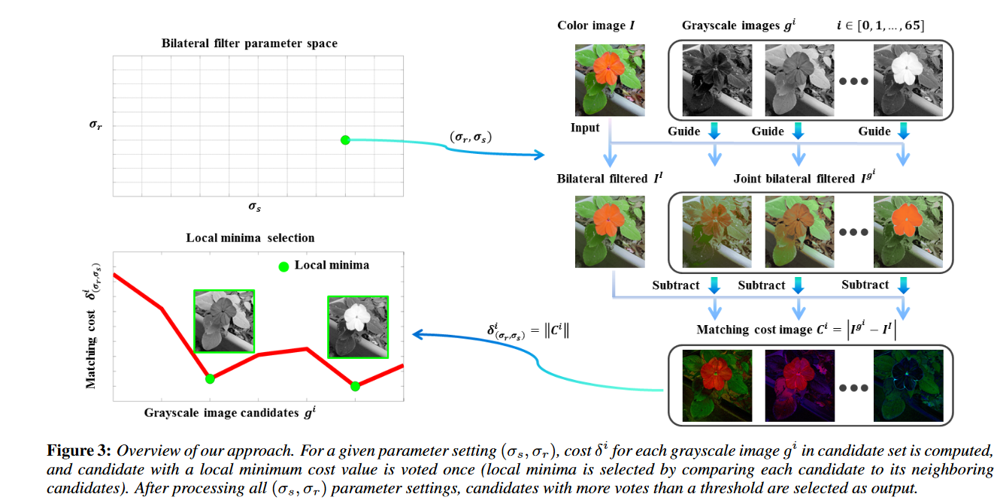

## Results

Input | Conventional | Advanced 1 | Advanced 2 | Advanced 3
--- | --- | --- | --- | --- 
 | 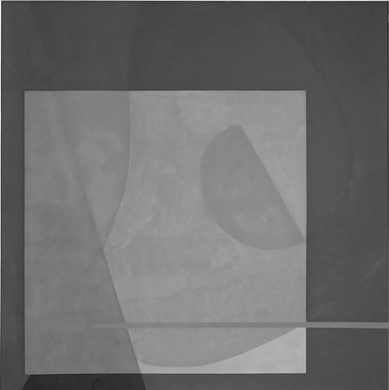 | 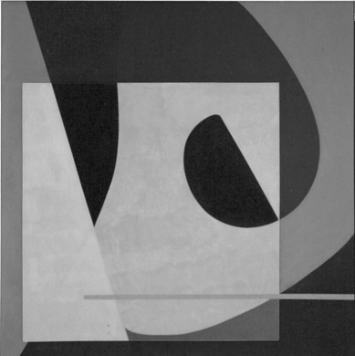 | 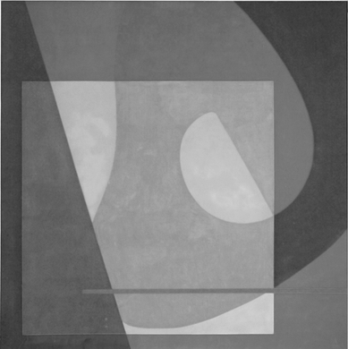| 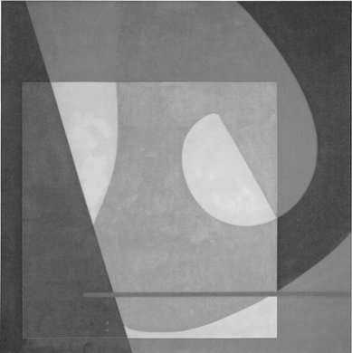
 | 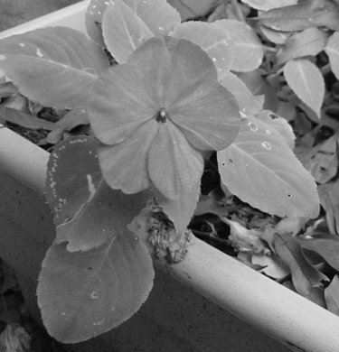 | 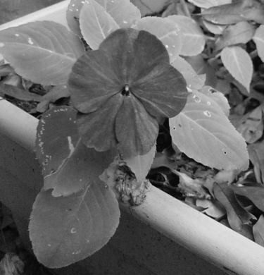 | 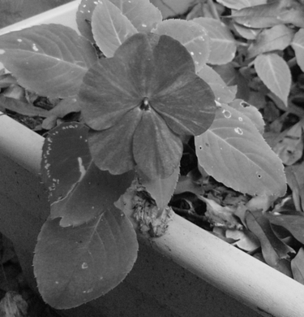| 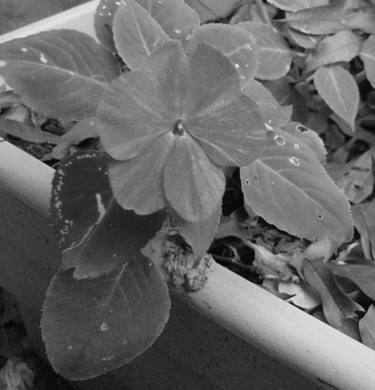
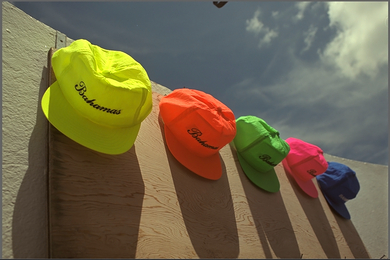 | 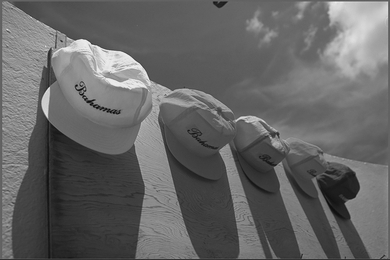 | 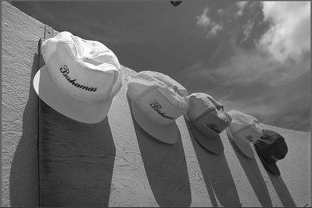 | 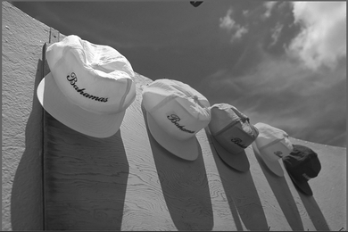| 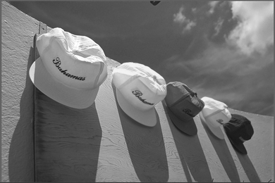
