# Assignment 1: Advanced Color-to-Gray Conversion

## Conventional rgb2gray

### Y = 0.299R + 0.587G + 0.114B

## Advanced rgb2gray

### Paper: Decolorization: Is rgb2gray() Out?[[1](#references)] [[project](https://ybsong00.github.io/siga13tb/)][[pdf](https://ybsong00.github.io/siga13tb/siga13tb_final.pdf)]
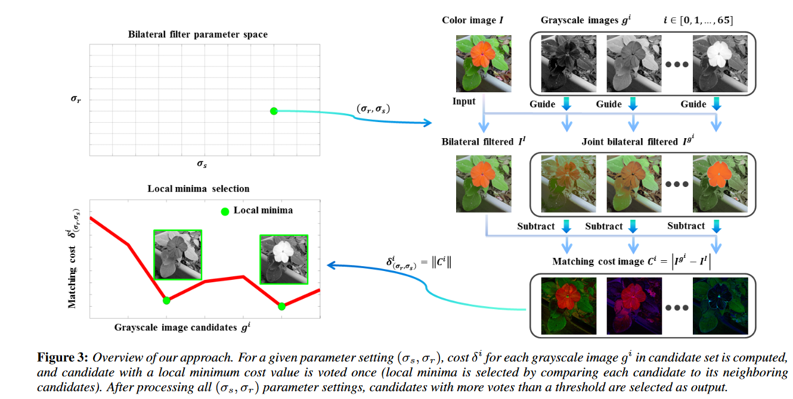

## Results

(wr, wg, wb)

Input | Conventional | Advanced 1 | Advanced 2 | Advanced 3
--- | --- | --- | --- | --- 
 | 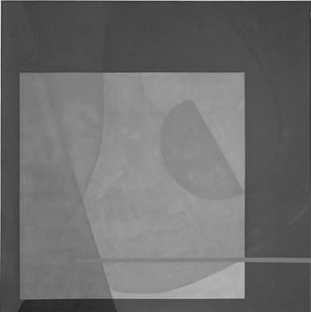 | 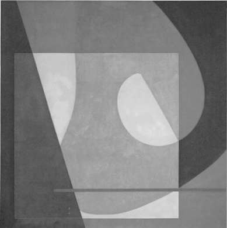 (0, 0, 1) votes=6 | 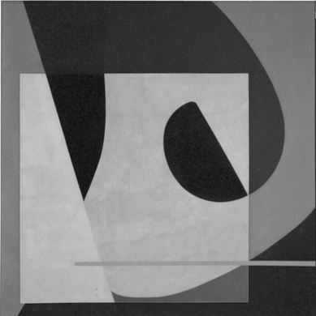 (0.8, 0.2, 0) votes=4 | 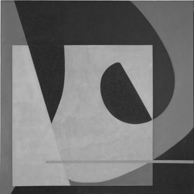 (1, 0, 0) votes=3
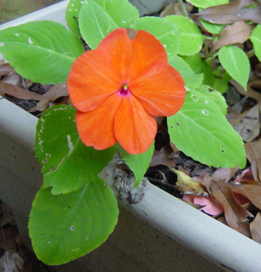 | 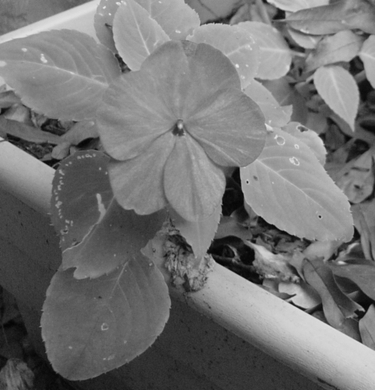 | 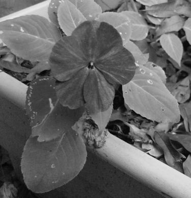 (0, 0.7, 0.3) votes=3 | 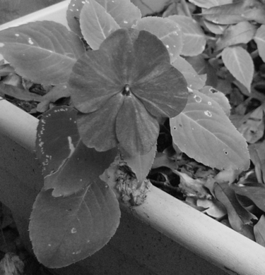 (0.1, 0.5, 0.4) votes=3 | 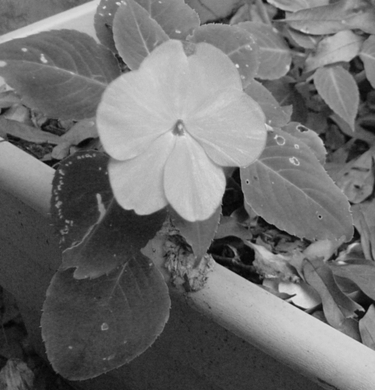 (0.3, 0.3, 0.4) votes=2
 | 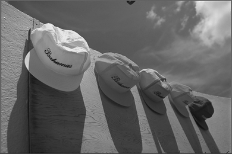 |  (0.5, 0.5, 0) votes=3 | 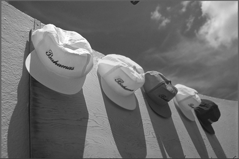 (0.6, 0.4, 0) votes=3 | 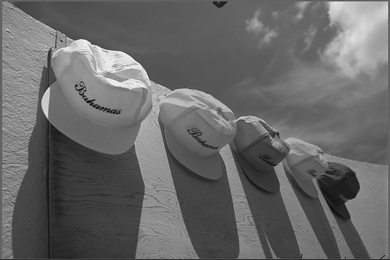 (0.9, 0.1, 0) votes=3

## Requirements
* numpy
* scikit-image

## References
[1] Y. Song, L. Bao, X. Xu, and Q. Yang, “Decolorization: Is rgb2gray()  out?” in Proc. ACM SIGGRAPH Asia Tech. Briefs, 2013, Art. ID 15.
