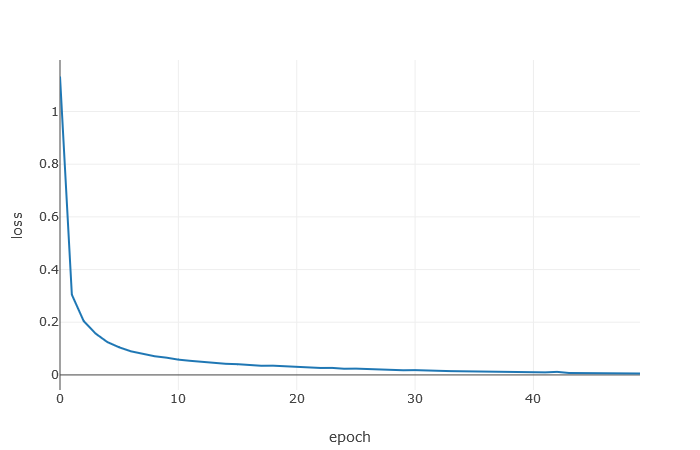
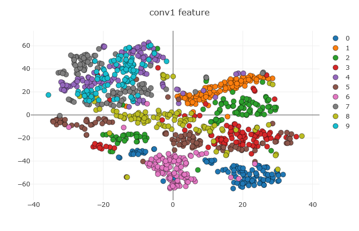
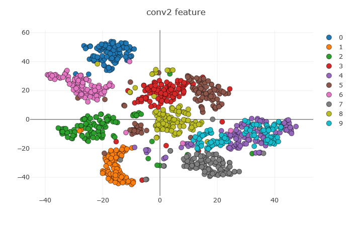

# Assignment 2: ML & DL Basics
ML & DL Basics [[slides](http://media.ee.ntu.edu.tw/courses/cv/18F/hw/cv2018_hw02.pdf)]
* ROC Curve [[link](#roc-curve)]
* PCA & LDA [[link](#pca--lda)]
* Object Recognition using CNN [[link](#object-recognition-using-cnn)]

## ROC Curve

## PCA & LDA

### PCA

#### Paper: Face Recognition Using Eigenfaces [[1](#references)] [[pdf](https://people.eecs.berkeley.edu/~johnw/cs294-97/papers/eigenface.pdf)]

#### EigenFace
mean | eigen1 | eigen2 | eigen3 | eigen4 | eigen5
--- | --- | --- | --- | --- | --- 
 |  |  |  | | 

#### Face Reconstruction
origin | 5 eigens | 50 eigens | 150 eigens| 279 eigens
--- | --- | --- | --- | --- 
   MSE: 0 |    MSE: 693 |    MSE: 119 |    MSE: 40 |    MSE: 8.9e-12

#### PCA + KNN
Training Accuracy

k | n | fold1 | fold2 | fold3 | average
--- | --- | --- | --- | --- | ---
1 | 3 | 80.0% | 72.5% | 65.8% | 72.8%
1 | 10 | 93.8% | 95.0% | 90.0% | 92.9%
**1** | **39** | **96.3%** | **97.5%** | **91.7%** | **95.1%**
3 | 3 | 67.5% | 61.3% | 60.8% | 63.2%
3 | 10 | 81.3% | 81.3% | 76.7% | 79.7%
3 | 39 | 90.0% | 87.5% | 80.0% | 85.8%
5 | 3 | 62.5% | 57.5% | 55.0% | 58.3%
5 | 10 | 72.5% | 68.8% | 66.7% | 69.3%
5 | 39 | 78.8% | 77.5% | 73.3% | 76.5%

Testing Accuracy

k | n | Accuracy
--- | --- | ---
**1** | **39** | **95.8%**

### PCA + LDA = Fisher Face

#### Paper: Eigenfaces vs. Fisherfaces: Recognition Using Class Specific Linear Projection [[2](#references)] [[pdf](https://cseweb.ucsd.edu/classes/wi14/cse152-a/fisherface-pami97.pdf)]

#### FisherFace
fisher1 | fisher2 | fisher3 | fisher4 | fisher5
--- | --- | --- | --- | --- 
 |  |  | | 

#### PCA + LDA + KNN
Training Accuracy

k | n | fold1 | fold2 | fold3 | average
--- | --- | --- | --- | --- | ---
1 | 3 | 51.3% | 37.5% | 40.0% | 42.9%
1 | 10 | 85.0% | 83.8.0% | 81.7% | 83.5%
1 | 39 | 96.3% | 96.3% | 90.0% | 94.2%
3 | 3 | 50.0% | 37.5% | 40.8% | 42.8%
3 | 10 | 83.8% | 83.8% | 81.7% | 83.1%
3 | 39 | 95.0% | 96.3% | 91.7% | 94.3%
5 | 3 | 50.0% | 37.5% | 40.0% | 42.5%
5 | 10 | 83.8% | 83.8% | 81.7% | 83.1%
**5** | **39** | **96.3%** | **97.5%** | **91.7%** | **95.1%**

Testing Accuracy

k | n | Accuracy
--- | --- | ---
**5** | **39** | **95.8%**

### TSNE Distribution of Testing Data
EigenFace | FisherFace
--- | ---
 | 

## Object Recognition using CNN
### Paper: Gradient-Based Learning Applied to Document Recognition [[3](#references)] [[pdf](http://yann.lecun.com/exdb/publis/pdf/lecun-01a.pdf)]

Dataset: MNIST

### Learning Curve

Loss | Accuracy
--- | ---
 | 

Accuracy

Training | Validation
--- | ---
99.92% | 98.67%

### Filter Visualization
Conv1

Conv2

### Feature Visualization

Conv1 | Conv2
--- | ---
 | 

## References
[1] Turk, M.A., Pentland, A.P.: Face recognition using eigenfaces. In: IEEE Conferenceon Computer Vision and Pattern Recognition. (1991)

[2] P. N. Belhumeur, J. P. Hespanha, and D. J. Kriegman: Eigenfaces vs. fisherfaces: recognition using class specific linear projection. IEEE Transactions on Pattern Analysis and Machine Intelligence. (1997)

[3] Y. LeCun, L. Bottou, Y. Bengio, and P. Haffner: Gradient-based learning applied to document recognition. In Proceedings of the IEEE. (1998)
