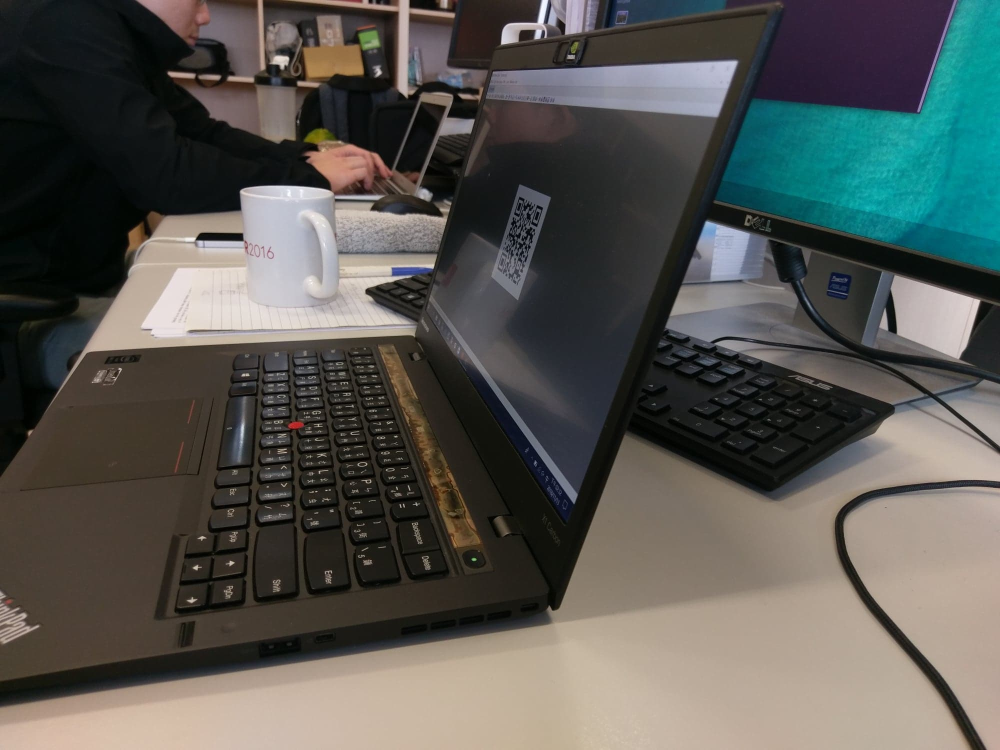
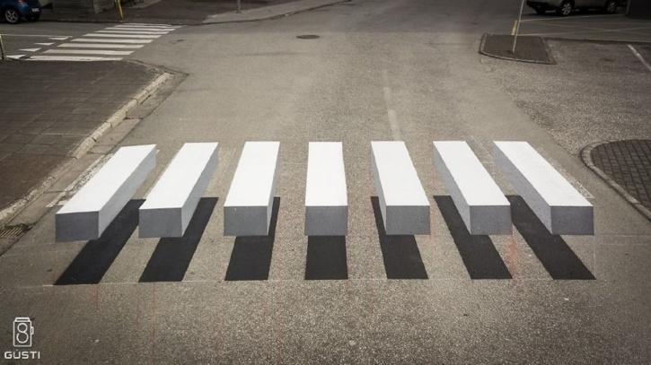
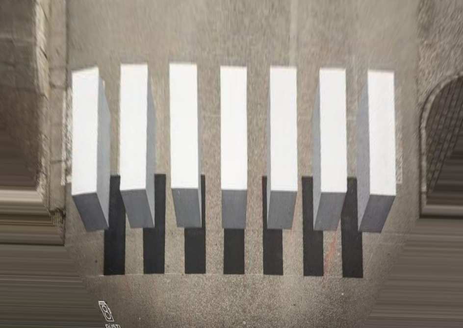
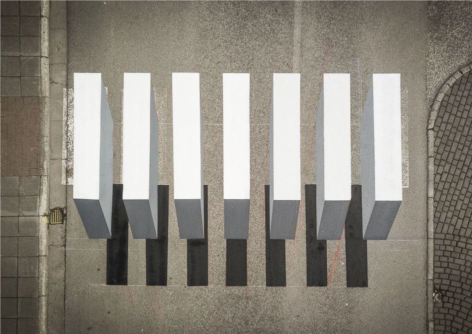

# Assignment 3: Projective Geometry
Projective Geometry [[slides](http://media.ee.ntu.edu.tw/courses/cv/18F/hw/cv2018_hw03.pdf)]
* Part 1: Estimating Homography [[link](#estimating-homography)]
* Part 2: Unwarp the Screen [[link](#unwarp-the-screen)]
* Part 3: Unwarp the 3D Illusion [[link](#unwarp-the-3d-illusion)]

## Estimating Homography
Warp images onto selected surfaces

## Unwarp the Screen

left front view | unwarped QR code
--- | ---
 | 

## Unwarp the 3D Illusion

front view | unwarped top view | real top view
--- | --- | ---
 |  | 
