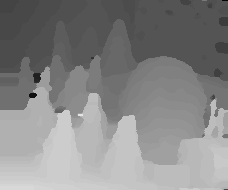
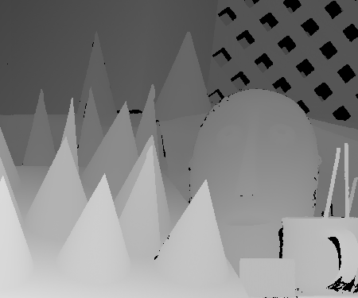

# Assignment 4: Stereo Matching
Stereo Matching [[slides](http://media.ee.ntu.edu.tw/courses/cv/18F/hw/cv2018_hw04.pdf)]
## Disparity Estimation

### Paper: Fast Cost-Volume Filtering for Visual Correspondence and Beyond [[1](#references)] [[pdf](http://wwwpub.zih.tu-dresden.de/~cvweb/publications/papers/2012/FastCost-VolumeFiltering.pdf)]

## Results

Left View | Right View | Disparity Eval | Ground Truth
--- | --- | --- | --- 
 |  |  | 
 |  |  | 
 |  |  | 
 |  |  | 

## Requirements
* numpy
* scikit-image

## References
[1] C. Rhemann, A. Hosni, M. Bleyer, C. Rother, and M. Gelautz, “Fast cost-volume filtering for visual correspondence and beyond,” in CVPR, 2011.
